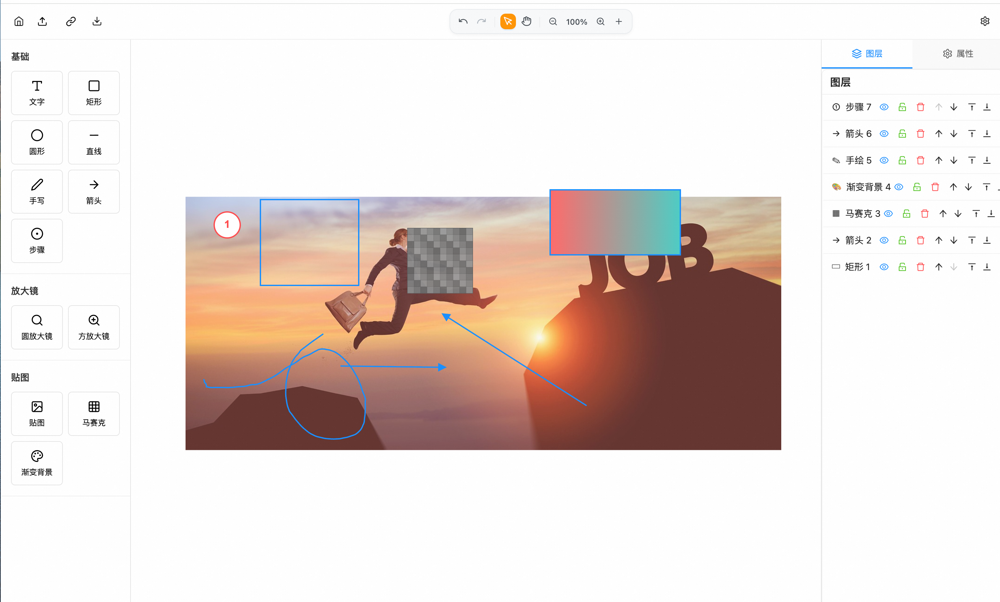

# 轻量级图片标注系统

基于 React 18 + KonvaJS + Rsbuild + TypeScript 构建的现代化图片标注工具。

## 项目预览



*智绘标注  - 轻量图片标注工具运行界面*

## 功能特性

### 🎨 丰富的标注工具

- **基础工具**: 文字、矩形、圆形、直线、箭头、手写笔、步骤标记
- **放大镜工具**: 圆形放大镜、方形放大镜
- **高级工具**: 贴图、马赛克、渐变背景
- **智能编辑**: 支持拖拽、缩放、旋转等交互操作

### 🎯 强大的编辑功能

- **实时属性编辑**: 颜色、大小、位置、透明度等
- **图层管理**: 完整的图层系统，支持显示/隐藏、锁定/解锁、层级调整
- **精确控制**: 像素级精度的位置和尺寸调整
- **批量操作**: 多选、复制、删除等批量编辑功能

### 🖼️ 图片处理

- **多格式支持**: 支持 JPG、PNG、GIF、WebP 等常见图片格式
- **贴图功能**: 支持添加自定义图片贴图，可调整大小和位置
- **马赛克工具**: 可调节像素大小和透明度的马赛克效果
- **渐变背景**: 支持水平、垂直、对角线渐变，自定义颜色

### 🔧 用户体验

- **直观操作**: 所见即所得的编辑体验
- **响应式设计**: 适配不同屏幕尺寸
- **快捷键支持**: 提高编辑效率
- **实时预览**: 编辑过程中实时查看效果

## 技术栈

- **前端框架**: React 18 + TypeScript
- **画布渲染**: Konva.js + React-Konva
- **构建工具**: Rsbuild
- **UI 组件**: Ant Design 5.x
- **图标库**: Lucide React + Ant Design Icons
- **包管理**: pnpm
- **开发语言**: TypeScript 5.x

## 项目结构

```
image-annotation-system/
├── src/
│   ├── components/          # React 组件
│   │   ├── AnnotationEditor.tsx    # 主编辑器
│   │   ├── Toolbar.tsx            # 顶部工具栏
│   │   ├── Sidebar.tsx            # 左侧工具面板
│   │   ├── PropertiesPanel.tsx    # 右侧属性面板
│   │   ├── LayerPanel.tsx         # 图层管理面板
│   │   ├── CanvasObjects.tsx      # 画布对象渲染
│   │   ├── RightPanel.tsx         # 右侧面板容器
│   │   └── ...
│   ├── types/               # TypeScript 类型定义
│   │   └── index.ts        # 核心类型定义
│   ├── utils/               # 工具函数
│   │   ├── helpers.ts      # 通用工具函数
│   │   ├── layerUtils.ts   # 图层管理工具
│   │   └── imageUtils.ts   # 图片处理工具
│   ├── App.tsx             # 应用根组件
│   └── main.tsx            # 应用入口
├── public/                  # 静态资源
├── dist/                   # 构建输出目录
├── package.json            # 项目配置
├── rsbuild.config.ts       # Rsbuild 配置
├── tsconfig.json           # TypeScript 配置
└── README.md
```

## 快速开始

### 环境要求

- Node.js >= 18.0.0
- pnpm >= 10.0.0

### 安装依赖

```bash
# 安装所有依赖
pnpm install
```

### 开发模式

```bash
# 启动开发服务器
pnpm dev
```

访问 <http://localhost:3000> 查看应用。

### 构建生产版本

```bash
# 构建生产版本
pnpm build
```

### 预览生产版本

```bash
# 预览构建结果
pnpm preview
```

## 主要组件

### AnnotationEditor

主编辑器组件，管理整个应用的状态和交互逻辑。

### Toolbar

顶部工具栏，包含常用操作按钮和缩放控制。

### Sidebar

左侧工具面板，提供各种标注工具的选择。

### PropertiesPanel

右侧属性面板，用于编辑选中图形的属性。

### CanvasObjects

画布对象渲染组件，负责渲染各种标注图形。

## 使用说明

1. **选择工具**: 在左侧工具面板选择需要的标注工具
2. **绘制图形**: 在画布上拖拽绘制图形
3. **编辑属性**: 选中图形后在右侧面板编辑属性
4. **缩放画布**: 使用顶部工具栏的缩放控制
5. **导出结果**: 使用导出功能保存标注结果

## 开发指南

### 添加新工具

1. 在 `types/index.ts` 中添加新的工具类型
2. 在 `Sidebar.tsx` 中添加工具配置
3. 在 `CanvasObjects.tsx` 中添加渲染逻辑
4. 在 `AnnotationEditor.tsx` 中添加交互逻辑

### 自定义样式

修改 `styles/global.css` 文件来自定义界面样式。

## 许可证

MIT License
