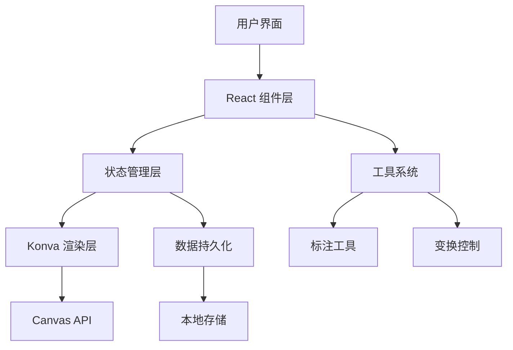

# 项目架构

本文档详细介绍图片标注系统的技术架构和设计理念。

## 整体架构

图片标注系统采用现代化的前端架构，基于以下核心技术：



## 技术栈

### 核心框架

- **React 18** - 用户界面框架
- **TypeScript** - 类型安全的 JavaScript
- **Konva.js** - 2D Canvas 图形库
- **React Konva** - Konva 的 React 绑定

### UI 组件库

- **Ant Design** - 企业级 UI 设计语言
- **Lucide React** - 现代化图标库

### 构建工具

- **Rsbuild** - 基于 Rspack 的构建工具
- **pnpm** - 高效的包管理器

## 目录结构

### 主应用结构

```
packages/web/src/
├── components/           # React 组件
│   ├── AnnotationEditor.tsx    # 主编辑器组件
│   ├── CanvasObjects.tsx       # 画布对象渲染
│   ├── Sidebar.tsx             # 工具栏组件
│   ├── PropertiesPanel.tsx     # 属性面板
│   └── LayerPanel.tsx          # 图层面板
├── types/                # TypeScript 类型定义
│   └── index.ts          # 核心类型定义
├── utils/                # 工具函数
│   ├── layerUtils.ts     # 图层相关工具
│   └── canvasUtils.ts    # 画布相关工具
├── hooks/                # 自定义 Hooks
│   ├── useCanvasState.ts # 画布状态管理
│   └── useKeyboard.ts    # 键盘事件处理
└── styles/               # 样式文件
    └── global.css        # 全局样式
```

## 核心组件设计

### 1. AnnotationEditor（主编辑器）

主编辑器是整个系统的核心组件，负责：

- 画布初始化和管理
- 工具切换和状态管理
- 事件处理和分发
- 图片加载和显示

```typescript
interface AnnotationEditorProps {
  width?: number;
  height?: number;
  onSave?: (data: AnnotationData) => void;
}
```

### 2. CanvasObjects（对象渲染）

负责渲染所有标注对象：

- 根据对象类型选择对应的渲染组件
- 处理对象的变换和交互
- 管理选中状态和变换器

```typescript
interface CanvasObjectsProps {
  objects: AnnotationObject[];
  selectedIds: string[];
  onSelect: (ids: string[]) => void;
  onTransform: (id: string, attrs: any) => void;
}
```

### 3. Sidebar（工具栏）

工具选择和切换界面：

- 展示所有可用工具
- 处理工具切换逻辑
- 显示当前选中工具状态

### 4. PropertiesPanel（属性面板）

对象属性编辑界面：

- 根据选中对象类型显示相应属性
- 实时更新对象属性
- 提供直观的属性编辑控件

## 数据流架构

### 状态管理

系统采用 React 的状态管理模式：

```typescript
interface CanvasState {
  // 画布基础状态
  selectedTool: ToolType;
  objects: AnnotationObject[];
  selectedIds: string[];
  
  // 画布视图状态
  scale: number;
  position: { x: number; y: number };
  
  // 图片状态
  imageUrl: string | null;
  imageSize: { width: number; height: number };
}
```

### 数据流向

1. **用户操作** → 触发事件处理函数
2. **事件处理** → 更新应用状态
3. **状态更新** → 触发组件重新渲染
4. **组件渲染** → 更新 Konva 画布
5. **画布更新** → 用户看到变化

## 工具系统架构

### 工具类型定义

```typescript
type ToolType = 
  | 'select'      // 选择工具
  | 'rectangle'   // 矩形工具
  | 'circle'      // 圆形工具
  | 'arrow'       // 箭头工具
  | 'text'        // 文本工具
  | 'mosaic'      // 马赛克工具
  | 'gradient'    // 渐变背景工具
  | 'image';      // 贴图工具
```

### 工具实现模式

每个工具都遵循统一的实现模式：

1. **工具定义** - 在 `ToolType` 中定义工具类型
2. **对象创建** - 在 `AnnotationEditor` 中处理工具的创建逻辑
3. **对象渲染** - 在 `CanvasObjects` 中实现对象的渲染
4. **属性编辑** - 在 `PropertiesPanel` 中提供属性编辑界面
5. **图层管理** - 在 `LayerPanel` 中显示和管理对象

## 渲染系统

### Konva 渲染层次

```
Stage (舞台)
└── Layer (图层)
    ├── Image (背景图片)
    ├── Group (标注对象组)
    │   ├── Rect (矩形)
    │   ├── Circle (圆形)
    │   ├── Arrow (箭头)
    │   ├── Text (文本)
    │   └── ... (其他对象)
    └── Transformer (变换器)
```

### 性能优化

- **对象池** - 复用 Konva 对象减少创建开销
- **批量更新** - 合并多个属性更新操作
- **懒加载** - 按需加载大图片和复杂对象
- **虚拟化** - 大量对象时的视口裁剪

## 事件系统

### 事件处理流程

1. **DOM 事件** → Konva 事件系统
2. **Konva 事件** → React 事件处理器
3. **React 处理器** → 状态更新
4. **状态更新** → 组件重渲染

### 关键事件

- `click` - 对象选择和工具操作
- `dragstart/dragmove/dragend` - 对象拖拽
- `transform/transformend` - 对象变换
- `wheel` - 画布缩放
- `keydown/keyup` - 快捷键处理

## 扩展性设计

### 新工具开发

添加新工具需要以下步骤：

1. 在 `types/index.ts` 中添加工具类型
2. 在 `AnnotationEditor` 中添加创建逻辑
3. 在 `CanvasObjects` 中添加渲染逻辑
4. 在 `PropertiesPanel` 中添加属性编辑
5. 在 `Sidebar` 中添加工具图标

### 插件系统（规划中）

未来版本将支持插件系统：

```typescript
interface ToolPlugin {
  name: string;
  type: string;
  icon: React.ComponentType;
  create: (options: any) => AnnotationObject;
  render: (object: AnnotationObject) => React.ReactNode;
  properties: PropertyDefinition[];
}
```

## 数据持久化

### 本地存储

- 使用 `localStorage` 保存标注数据
- 自动保存用户操作历史
- 支持多个项目的数据隔离

### 导出格式

- **PNG/JPG** - 栅格图片格式
- **SVG** - 矢量图片格式
- **JSON** - 标注数据格式

## 性能监控

### 关键指标

- **首屏加载时间** - 应用启动性能
- **工具切换延迟** - 交互响应性能
- **大图片处理** - 内存使用情况
- **复杂场景渲染** - 帧率和流畅度

### 优化策略

- 代码分割和懒加载
- 图片压缩和缓存
- 虚拟滚动和对象池
- Web Worker 处理复杂计算

## 浏览器兼容性

### 支持的浏览器

- Chrome 90+
- Firefox 88+
- Safari 14+
- Edge 90+

### 关键 API 依赖

- Canvas API
- File API
- Web Storage API
- ES2020+ 语法特性

## 安全考虑

### 客户端安全

- 所有图片处理在客户端完成
- 不向服务器传输用户图片
- 本地存储数据加密（规划中）

### 代码安全

- TypeScript 类型检查
- ESLint 代码规范检查
- 依赖安全扫描